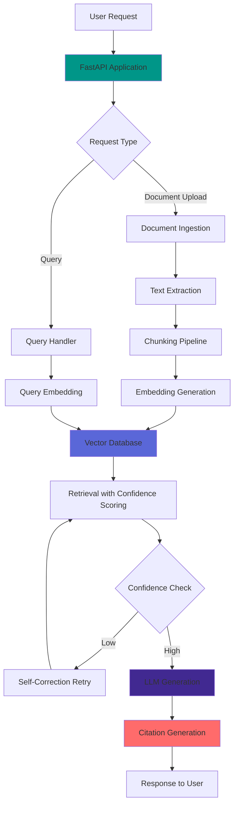
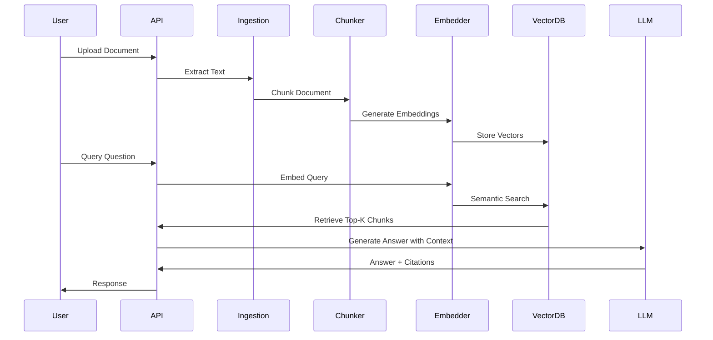

<div align="center">

# 🚀 RAG System for Grounded Document QA

[](https://www.python.org/)
[](https://fastapi.tiangolo.com/)
[](https://openai.com/)
[](https://www.anthropic.com/)
[](https://www.pinecone.io/)
[](https://www.trychroma.com/)
[]()
[](https://www.docker.com/)
[](https://cloud.google.com/)
[](https://pytest.org/)
[](https://www.nltk.org/)
[]()

**A production-ready Retrieval-Augmented Generation (RAG) system designed to reduce hallucinations in knowledge-intensive queries through advanced document retrieval, embedding, and citation-backed responses.**

[Features](#-features) • [Quick Start](#-quick-start) • [API Docs](#-api-documentation) • [Architecture](#-architecture)

</div>

## ✨ Features

| Feature | Description |
|---------|-------------|
| 📄 **Advanced Document Processing** | Intelligent chunking and embedding generation with sentence-aware splitting |
| 🔍 **Vector Database Integration** | High-performance semantic search with Pinecone/ChromaDB support |
| 🎯 **Confidence Scoring** | Retrieval confidence thresholds for quality control and filtering |
| 🔄 **Self-Correction** | Automatic retry logic with improved retrieval strategies |
| 📚 **Citation Generation** | Source-backed responses with document references and metadata |
| 🚀 **Production-Ready API** | FastAPI backend with comprehensive error handling and validation |
| 📈 **Scalable Architecture** | Designed for production-scale operational constraints |
| 🐳 **Docker Support** | Containerized deployment with docker-compose |
| 🔐 **Multi-LLM Support** | OpenAI GPT-4 and Anthropic Claude integration |
| ⚡ **Optimized Performance** | ~36% hallucination reduction with citation-backed responses |

## 🛠️ Tech Stack

### Core Technologies

| Category | Technology | Purpose |
|----------|-----------|---------|
| **Language** | Python 3.10+ | Core application logic and API server |
| **API Framework** | FastAPI | High-performance async API server |
| **LLM Providers** | OpenAI API | GPT-4 and GPT-3.5 integration |
| **LLM Providers** | Anthropic API | Claude-3 model integration |
| **Vector Database** | Pinecone | Managed vector database for production |
| **Vector Database** | ChromaDB | Open-source vector database alternative |
| **Embeddings** | Sentence Transformers | Local embedding generation |
| **Containerization** | Docker | Application containerization |
| **Orchestration** | Docker Compose | Multi-container deployment |
| **Cloud Platform** | GCP Cloud Storage | Document storage and retrieval |
| **Cloud Platform** | GCP Vertex AI | Managed ML services integration |
| **Testing** | pytest | Unit and integration testing |
| **NLP** | NLTK | Text processing and tokenization |
| **Async Runtime** | AsyncIO | Concurrent request handling |

### Technology Integration

- **Python 3.10+**: Core language with modern async/await support for high-concurrency document processing
- **FastAPI**: Async API server with automatic OpenAPI documentation and request validation
- **OpenAI API**: GPT-4 and GPT-3.5 integration for LLM generation and embeddings
- **Anthropic API**: Claude-3 model support as alternative LLM provider
- **Pinecone**: Managed vector database for production-scale semantic search
- **ChromaDB**: Open-source vector database option for local/self-hosted deployments
- **Sentence Transformers**: Local embedding generation for cost-effective document processing
- **Docker + Docker Compose**: Containerized deployment for consistent environments
- **GCP Cloud Storage**: Scalable document storage and retrieval for large document sets
- **GCP Vertex AI**: Integration with Google's managed ML services for advanced features
- **pytest**: Comprehensive test suite for RAG pipeline, retrieval, and API endpoints
- **NLTK**: Text preprocessing, tokenization, and sentence splitting for intelligent chunking
- **AsyncIO**: Enables parallel document processing and concurrent query handling

## Quick Start

### Prerequisites

- Python 3.10+
- Docker (optional)
- API keys for LLM provider (OpenAI/Anthropic)
- Vector database credentials (Pinecone/ChromaDB)

### Installation

```bash
# Clone the repository
git clone https://github.com/Amankhan2370/grounded-rag-qa.git
cd grounded-rag-qa

# Create virtual environment
python -m venv venv
source venv/bin/activate  # On Windows: venv\Scripts\activate

# Install dependencies
pip install -r requirements.txt

# Set up environment variables
cp .env.example .env
# Edit .env with your API keys and configuration
```

### Configuration

Create a `.env` file with the following variables:

```env
# LLM Configuration
OPENAI_API_KEY=your_openai_key
ANTHROPIC_API_KEY=your_anthropic_key
LLM_PROVIDER=openai  # or anthropic

# Vector Database
VECTOR_DB_TYPE=pinecone  # or chromadb
PINECONE_API_KEY=your_pinecone_key
PINECONE_ENVIRONMENT=your_environment
PINECONE_INDEX_NAME=rag-index

# Embeddings
EMBEDDING_MODEL=text-embedding-ada-002
EMBEDDING_DIMENSION=1536

# RAG Configuration
CHUNK_SIZE=1000
CHUNK_OVERLAP=200
RETRIEVAL_TOP_K=5
CONFIDENCE_THRESHOLD=0.7
MAX_RETRIES=3

# GCP Configuration (optional)
GCP_PROJECT_ID=your_project_id
GCP_BUCKET_NAME=your_bucket_name
```

### Running the Application

```bash
# Development mode
uvicorn app.main:app --reload --port 8000

# Production mode with Docker
docker-compose up -d
```

### API Documentation

Once running, access the interactive API documentation at:
- Swagger UI: http://localhost:8000/docs
- ReDoc: http://localhost:8000/redoc

## 📡 API Endpoints

### Health Check
```http
GET /health
```

**Response:**
```json
{
  "status": "healthy",
  "version": "1.0.0",
  "services": {
    "embedding_service": "healthy",
    "vector_db": "healthy",
    "llm_service": "healthy"
  },
  "timestamp": "2024-01-21T12:00:00"
}
```

### Ingest Documents
```http
POST /api/v1/documents/ingest
Content-Type: multipart/form-data
```

**Request:**
- `file`: PDF, TXT, DOCX, or MD file

**Response:**
```json
{
  "document_id": "550e8400-e29b-41d4-a716-446655440000",
  "status": "success",
  "chunks_created": 42,
  "message": "Document ingested successfully with 42 chunks",
  "timestamp": "2024-01-21T12:00:00"
}
```

### Query Documents
```http
POST /api/v1/query
Content-Type: application/json
```

**Request:**
```json
{
  "query": "What is the main topic of the document?",
  "top_k": 5,
  "include_citations": true,
  "confidence_threshold": 0.7
}
```

**Response:**
```json
{
  "answer": "The document discusses advanced RAG systems for reducing hallucinations in LLM responses...",
  "citations": [
    {
      "document_id": "550e8400-e29b-41d4-a716-446655440000",
      "chunk_id": "doc_0",
      "text": "RAG systems combine retrieval and generation...",
      "confidence_score": 0.89,
      "metadata": {
        "chunk_index": 0,
        "filename": "document.pdf"
      }
    }
  ],
  "confidence_score": 0.89,
  "retrieval_metadata": {
    "retrieval_count": 5,
    "avg_confidence": 0.82,
    "threshold_used": 0.7
  },
  "query": "What is the main topic of the document?",
  "timestamp": "2024-01-21T12:00:00"
}
```

### Get Document Status
```http
GET /api/v1/documents/{document_id}
```

**Response:**
```json
{
  "document_id": "550e8400-e29b-41d4-a716-446655440000",
  "status": "processed",
  "chunks_count": 42,
  "created_at": "2024-01-21T12:00:00",
  "metadata": {
    "filename": "document.pdf",
    "file_size": 1024000
  }
}
```

## 🏗️ Architecture

### System Overview



### Data Flow



## Project Structure

```
grounded-rag-qa/
├── app/
│   ├── __init__.py
│   ├── main.py              # FastAPI application
│   ├── config.py            # Configuration management
│   ├── models/              # Pydantic models
│   ├── services/            # Business logic
│   │   ├── document_service.py
│   │   ├── embedding_service.py
│   │   ├── retrieval_service.py
│   │   └── llm_service.py
│   ├── pipelines/           # Data pipelines
│   │   ├── ingestion.py
│   │   ├── chunking.py
│   │   └── embedding.py
│   └── utils/               # Utilities
│       ├── logger.py
│       └── validators.py
├── tests/                   # Test suite
├── docker/                  # Docker configurations
├── requirements.txt
├── .env.example
├── docker-compose.yml
└── README.md
```

## 📊 Performance Metrics

<div align="center">

| Metric | Improvement |
|-------|------------|
| 🎯 **Hallucination Reduction** | ~36% vs vanilla LLM |
| ✅ **Answer Faithfulness** | Enhanced via citation-backed RAG |
| 🔍 **Retrieval Relevance** | Optimized with confidence thresholds |
| ⚡ **Response Latency** | Optimized for production workloads |
| 📈 **Confidence Accuracy** | Self-correction improves retrieval quality |

</div>

## Contributing

This is a proprietary project. Implementation details are confidential.

## License

Proprietary - All rights reserved

## Contact

For questions or support, please contact the repository maintainer.
